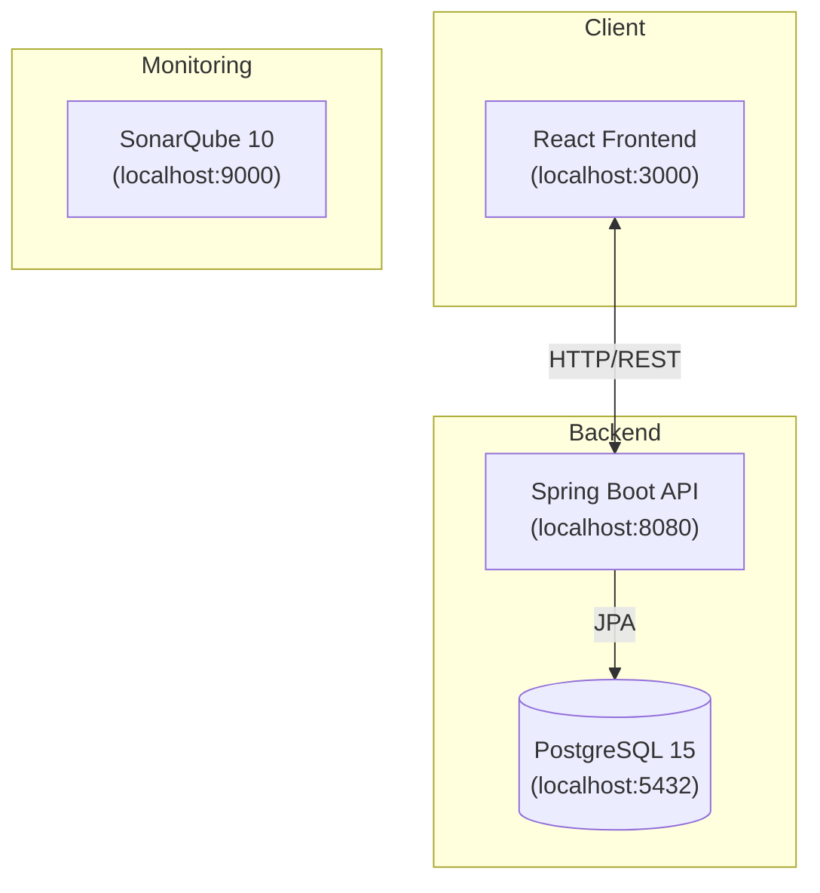

#  Projet GIT — Groupe D
> Système de gestion de catalogue produits avec génération de descriptions marketing par IA


---

##  Problème résolu

Les TPE/PME qui ouvrent leur première boutique en ligne perdent en moyenne **3 à 5 heures par semaine** à rédiger manuellement leurs fiches produits. Notre solution automatise la génération de descriptions marketing à partir de simples mots-clés.

---

##  Équipe — Groupe D

| Membre | Rôle |
|--------|------|
| Aya Anam | Workflow & Release Manager |
| El Fellah Meryem | Feature & AI Lead |
| Fatima Zahra Ait Lamine | Quality & Refactoring Lead |
| Youssef Fellah | Business & Documentation Lead |

---

##  Architecture



---

##  Prérequis

- Java 17+
- Maven 3.9+
- Docker & Docker Compose
- Node.js 18+ & npm
- Git 2.40+

---

##  Installation & Lancement (Fedora 43)

### 1. Cloner le projet

```bash
git clone https://github.com/<username>/projet-git-groupe-d.git
cd projet-git-groupe-d
```

### 2. Configuration des variables d'environnement

```bash
cp backend/src/main/resources/application.properties \
   backend/src/main/resources/application-local.properties

# éditer application-local.properties
nano backend/src/main/resources/application-local.properties
# → Remplacer AI_API_KEY par votre clé réelle
```

### 3. Démarrer les services Docker

```bash
# Prérequis Fedora — paramètre kernel pour SonarQube
sudo sysctl -w vm.max_map_count=262144

# Démarrer PostgreSQL + SonarQube
docker compose up -d postgres sonarqube

# Vérifier que les services sont UP
docker compose ps
```

### 4. Lancer le backend

```bash
cd backend
mvn spring-boot:run
# L'API sera accessible sur http://localhost:8080
```

### 5. Lancer le frontend

```bash
cd frontend
npm install
npm start
# L'interface sera accessible sur http://localhost:3000
```

---

##  Endpoints API

| Méthode | URL | Description |
|---------|-----|-------------|
| `GET` | `/api/products` | Liste tous les produits |
| `GET` | `/api/products/{id}` | Récupère un produit |
| `POST` | `/api/products` | Crée un produit |
| `PUT` | `/api/products/{id}` | Modifie un produit |
| `DELETE` | `/api/products/{id}` | Supprime un produit |
| `POST` | `/api/products/{id}/generate-description` | Génère une description IA |

---

##  Analyse de qualité (SonarQube)

```bash
# Lancer l'analyse
cd backend && mvn clean package -DskipTests
mvn sonar:sonar -Dsonar.host.url=http://localhost:9000

# Résultats : http://localhost:9000/dashboard?id=projet-git-groupe-d
```

---

##  Workflow Git

```
main ──────────────────────────────► [v1.0]
  └── develop ──────────────────────►
        ├── feature/crud-products
        ├── feature/ci-sonar
        ├── feature/base-readme
        ├── feature/ia-marketing
        ├── feature/design-pattern
        └── feature/pitch-deck

hotfix/currency-display (depuis main → merge main + develop)
```
